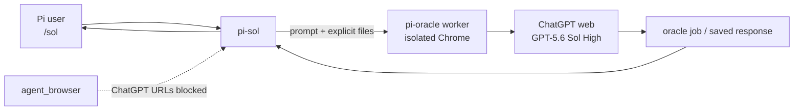

# pi-sol — `/sol` for ChatGPT GPT-5.6 Sol High inside Pi

**Ask ChatGPT web GPT-5.6 Sol High without leaving your Pi coding-agent session.**

`pi-sol` is a thin Pi extension over [pi-oracle](https://github.com/fitchmultz/pi-oracle). Pi prepares the question and any files you explicitly select; an isolated pi-oracle browser worker owns the ChatGPT session and returns the answer to Pi.

The preset is fixed to ChatGPT Plus **High** (`thinking_extended`). `/sol` does not silently fall back to Instant or Standard.


中文：**直接在 Pi 里调用网页版 ChatGPT GPT-5.6 Sol High。** 浏览器登录态由隔离的 pi-oracle worker 管理；Plus 最高档是 **High**，不是 Extra High / Pro。

---

## Contents

- [Requirements](#requirements)
- [Quick start](#quick-start)
- [Commands](#commands)
- [Why pi-sol?](#why-pi-sol)
- [How it works](#how-it-works)
- [Behavior guarantees](#behavior-guarantees)
- [Troubleshooting](#troubleshooting)
- [FAQ](#faq)
- [Development](#development)
- [Contributing](#contributing)
- [License](#license)

---

## Requirements

Before installing, make sure you have:

- A working [Pi](https://github.com/badlogic/pi-mono) installation
- `npm:pi-oracle` installed
- A ChatGPT **Plus** account signed in through local Chrome
- Node.js **22 or newer**
- Chrome's interface language set to **English** before running `/sol-auth`

> [!IMPORTANT]
> **Chrome must use an English UI for ChatGPT authentication.**
>
> With a Chinese Chrome UI, the isolated browser can become stuck on Cloudflare「请稍候…」 or `about:blank`, leaving `/sol-auth` without a usable ChatGPT session.
>
> Open `chrome://settings/languages`, move **English** to the top, fully quit and relaunch Chrome, then run `/sol-auth` again.

> [!NOTE]
> The bundled worker compatibility patch targets **pi-oracle 0.7.20**. `pi-sol` will not overwrite a different or newer pi-oracle version with the bundled 0.7.20 worker.

---

## Quick start

### 1. Install

```bash
git clone https://github.com/xiangbianpangde/pi-sol.git
cd pi-sol
./scripts/install.sh
```

The installer copies the extension, the skill, and the patched worker into your Pi configuration (`~/.pi/agent/`).

### 2. Reload Pi

In Pi:

```text
/reload
```

Or start a new Pi session.

### 3. Authenticate ChatGPT

```text
/sol-auth
```

This copies ChatGPT login cookies from your local Chrome profile into pi-oracle's isolated browser seed.

### 4. Verify it works

```text
/sol ping
```

Then try a real question:

```text
/sol Review this architecture decision and identify the three highest-risk assumptions.
```

By default, `/sol` waits for the Sol High answer and returns it directly in Pi.

---

## Commands

| Command | What it does |
|---|---|
| `/sol [--bg] [--follow <job-id>] [--files a,b] <prompt>` | Ask ChatGPT GPT-5.6 Sol High. Waits for the answer by default. |
| `/sol-followup <job-id> [--bg] [--files a,b] <prompt>` | Continue an earlier `/sol` ChatGPT thread. |
| `/sol-read [job-id]` | Read a saved job. With no ID, reads the latest available `/sol` job. |
| `/sol-auth` | Sync ChatGPT cookies from local Chrome into pi-oracle's isolated browser seed. |

### Common options

- **Default:** synchronous — wait for Sol and return the answer in Pi.
- **`--bg`:** submit in the background and return a job ID; read it later with `/sol-read`.
- **`--files a,b`:** send only the explicitly listed files. Maximum **10 files** per turn. Whole repositories are never auto-archived.
- **`--follow <job-id>`:** continue an existing ChatGPT thread from `/sol`.

The model preset is always `thinking_extended`, which `pi-sol` uses for GPT-5.6 Sol **High** on ChatGPT Plus. It does not silently downgrade to Instant or Standard. See [SKILL.md](./skills/sol/SKILL.md) for the full in-Pi operating procedure.

---

## Why pi-sol?

`pi-sol` gives Pi one controlled path to ChatGPT web:

- Stay inside the Pi workflow instead of manually switching to ChatGPT.
- Let Pi prepare the question and explicitly selected local files.
- Use synchronous or background `/sol` jobs.
- Continue an earlier ChatGPT thread with `/sol-followup`.
- Keep ChatGPT browser automation inside pi-oracle's isolated worker.
- Auto-restore the supported High / Power-slider compatibility patch when needed.

### pi-sol vs opening chatgpt.com

| | `pi-sol` | Open ChatGPT manually |
|---|---|---|
| Stay inside Pi | Yes | No |
| Pi prepares the request | Yes | Manual |
| Explicit local file staging | `--files` | Manual upload |
| Background Pi job | `--bg` + `/sol-read` | No Pi-managed job |
| Follow an earlier `/sol` thread | `/sol-followup` | Separate browser workflow |
| ChatGPT browser ownership | Isolated pi-oracle worker | Your normal browser |
| pi-oracle High compatibility handling | Automatic where supported | Not applicable |

### Compatibility with pi-oracle 0.7.20

`pi-oracle 0.7.20` was written for an older ChatGPT model-selection UI. ChatGPT Plus now exposes **High** and a **Power** slider, which can make the unpatched worker fail with errors such as:

```text
Could not open effort dropdown for requested effort: Extended
Could not find model family control for instant
```

`pi-sol` bundles the corresponding 0.7.20 worker patch and restores it automatically if `pi update npm:pi-oracle` replaces the patched worker.

If the installed pi-oracle version is no longer 0.7.20, `pi-sol` refuses to overwrite it with the bundled older worker.

---

## How it works



`pi-sol` does not create a second ChatGPT browser session. Browser automation for ChatGPT stays inside pi-oracle's isolated worker.

Before a supported submit, `pi-sol` checks that the bundled pi-oracle 0.7.20 High / Power-slider patch is present. If an update replaced it, `pi-sol` restores it automatically. The patch is version-gated: `pi-sol` will not copy its bundled 0.7.20 worker over a different pi-oracle version.

The detailed hydration rules and decision logic live in [SKILL.md](./skills/sol/SKILL.md) and the test suite.

---

## Behavior guarantees

### Model selection

- `/sol` targets GPT-5.6 Sol **High** on ChatGPT Plus.
- The internal preset name is `thinking_extended`.
- `pi-sol` does not silently fall back to Instant or Standard.
- Extra High / Pro is not treated as the Plus High preset.

### Browser ownership

ChatGPT browser automation belongs exclusively to pi-oracle's isolated worker. For that reason, `pi-sol` blocks `agent_browser` from opening:

- `chatgpt.com`
- `chat.openai.com`
- `auth.openai.com`

This prevents two browser-automation paths from competing for the ChatGPT session. Use `/sol` for ChatGPT instead.

### Files

Files are strictly opt-in:

```text
/sol --files paper.pdf,src/example.ts <prompt>
```

`pi-sol` does not archive or upload the whole repository automatically. A maximum of **10 files** can be selected per turn, and unsupported or oversized uploads are rejected before submission (executables, installers, oversize images, etc. are blocked).

### Authentication and policy failures

Login, challenge, and content-policy failures are treated as **terminal** conditions. `pi-sol` does not bypass them or silently switch to another model.

### pi-oracle updates

`pi update npm:pi-oracle` can replace the installed worker. When the installed version matches the supported 0.7.20 worker, `pi-sol` automatically restores its High / Power-slider compatibility patch on every `session_start` and before each `/sol`. A different pi-oracle version is left untouched.

You do not need to run a patch script manually — and you should not, against a different pi-oracle version.

For coding-agent invariants, see [AGENTS.md](./AGENTS.md).
For patch-development rules, see [CONTRIBUTING.md](./CONTRIBUTING.md).

---

## Troubleshooting

### `/sol-auth` is stuck on「请稍候…」 or `about:blank`

Check Chrome's interface language first.

1. Open `chrome://settings/languages`.
2. Move **English** to the top.
3. Fully quit Chrome.
4. Relaunch Chrome.
5. Run:

```text
/sol-auth
```

A Chinese Chrome UI can prevent the isolated oracle browser from obtaining a usable ChatGPT session.

### `/sol-auth` says the Chrome cookie database is locked

Fully quit Chrome once, then retry:

```text
/sol-auth
```

The browser can temporarily lock the cookie database while it is running.

### I get `Could not open effort dropdown for requested effort: Extended`

You may also see:

```text
Could not find model family control for instant
```

These are the pi-oracle 0.7.20 UI-compatibility errors that the bundled High / Power-slider patch is designed to handle. `pi-sol` restores the supported patch automatically; reload Pi (or start a new session) and retry the same `/sol` request. Do not work around the problem by silently switching the request to Instant or Standard.

If it continues, check which pi-oracle version is installed.

### pi-sol reports a pi-oracle version mismatch

The bundled worker patch targets pi-oracle **0.7.20**. If another version is installed, `pi-sol` intentionally refuses to overwrite that worker with its bundled older files. Do not force-copy the 0.7.20 vendor worker over a different pi-oracle version.

### `/sol` says High is unavailable

`/sol` is intentionally fixed to Plus High. Check that:

- You are authenticated to the intended ChatGPT Plus account (`/sol-auth` succeeds).
- The ChatGPT session itself exposes High.

`pi-sol` will not silently substitute Instant or Standard.

### `agent_browser` refuses to open chatgpt.com

This is expected behavior. ChatGPT browser automation is reserved for pi-oracle's isolated worker so two browser sessions do not compete. Use:

```text
/sol <question>
```

instead.

### A file is rejected before `/sol` submits

`--files` is validated before submission:

- Only explicitly listed files are sent.
- Maximum **10 files** per turn.
- Executables / installers are rejected.
- ChatGPT web upload-size limits still apply.

Remove the unsupported file or reduce the upload set and retry.

### `/sol-read` says no jobs were found

Run a `/sol` request first:

```text
/sol --bg <question>
```

Then read the returned job:

```text
/sol-read <job-id>
```

With no job ID, `/sol-read` attempts to use the latest available `/sol` job.

---

## FAQ

### What is "Sol High"?

In this project, **Sol High** means ChatGPT web GPT-5.6 using the ChatGPT Plus **High** reasoning setting. `pi-sol` refers to that preset internally as `thinking_extended`. It is not the same thing as Extra High or Pro.

### What is `thinking_extended`?

`thinking_extended` is the pi-oracle preset name used by `/sol` for the ChatGPT Plus High setting. It is an implementation-level name. As a user, you normally only need to run:

```text
/sol <question>
```

### Does `/sol` ever fall back to Instant or Standard?

No. If the requested High configuration cannot be established, `pi-sol` treats that as an error rather than silently returning an answer from a lower setting.

### Why does Chrome have to be in English?

`/sol-auth` imports your existing ChatGPT login into pi-oracle's isolated browser environment. With an affected Chinese Chrome UI, the authentication flow can become stuck on Cloudflare「请稍候…」 or `about:blank`. Set English first in `chrome://settings/languages`, then fully relaunch Chrome and run `/sol-auth` again.

### Why not just open chatgpt.com with `agent_browser`?

pi-oracle already owns an isolated browser session for ChatGPT. Opening ChatGPT through Pi's general `agent_browser` creates a second automation path that can collide with the oracle worker session. `pi-sol` therefore blocks ChatGPT URLs in `agent_browser` intentionally. Use `/sol` for ChatGPT instead.

### Is my prompt or file data sent to OpenAI?

Yes. `/sol` submits your question to ChatGPT web, so the prompt is sent to ChatGPT / OpenAI as part of that request. Files are sent **only** when you explicitly list them with `--files`; `pi-sol` does not automatically archive or upload the whole repository. `/sol-auth` copies your local ChatGPT session cookies into pi-oracle's isolated browser seed — do not commit, publish, or share those cookies or browser-profile data.

### What happens after `pi update npm:pi-oracle`?

An update can replace pi-oracle's installed worker and therefore remove the `pi-sol` compatibility patch. For the supported pi-oracle 0.7.20 worker, `pi-sol` detects this on the next `session_start` (and before every `/sol`) and restores the bundled High / Power-slider patch automatically. You should not need to run a patch script manually. If the installed pi-oracle version is different, `pi-sol` refuses to overwrite it with its bundled 0.7.20 worker.

---

## Development

### Tests

```bash
npm test
```

The test suite covers:

- `/sol` command parsing
- Explicit file staging and validation (`--files` limits, executable rejection)
- The `agent_browser` ChatGPT-domain guard
- High / Power-slider UI handling
- Preventing Instant or Medium from being accepted as High
- Automatic patch restoration after a simulated `pi-oracle` update
- Refusing to overwrite an unsupported or newer `pi-oracle` version

### Project layout

```text
extensions/sol.ts              Pi slash commands + hooks
extensions/lib/sol/            parse, files, guard, jobs, prompts, patches
extensions/lib/sol/vendor/     patched pi-oracle 0.7.20 worker (MIT)
extensions/__tests__/          node:test suite
skills/sol/SKILL.md            in-Pi model procedure
scripts/install.sh             copy into ~/.pi/agent
```

---

## Contributing

Bug reports and pull requests are welcome.

Before changing `/sol` behavior or the bundled worker patch, read:

- [`CONTRIBUTING.md`](./CONTRIBUTING.md) — patch and test requirements
- [`AGENTS.md`](./AGENTS.md) — coding-agent invariants
- [`skills/sol/SKILL.md`](./skills/sol/SKILL.md) — in-Pi oracle procedure

When reporting a problem, include:

- Pi version
- `pi-oracle` version
- Operating system
- The exact `/sol` command or error message
- Whether `/sol-auth` succeeds

**Never attach ChatGPT cookies, Chrome profiles, or `oracle-auth-seed-profile` data to an issue.**

Project: [github.com/xiangbianpangde/pi-sol](https://github.com/xiangbianpangde/pi-sol)

---

## License

MIT. Vendor worker files are patched from [pi-oracle](https://github.com/fitchmultz/pi-oracle) (MIT, © Mitch Fultz). See [NOTICE](./NOTICE).
