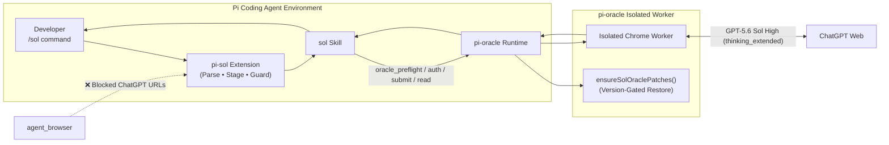
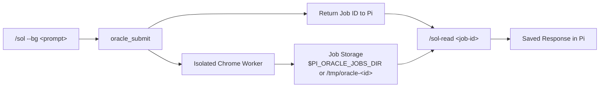

<div align="center">

# `pi-sol`

**Ask ChatGPT web GPT-5.6 Sol High without leaving your Pi coding-agent session.**

[](./LICENSE)
[](https://nodejs.org)
[-10a37f.svg?style=flat-square)](https://chatgpt.com)
[](https://github.com/badlogic/pi-mono)
[](./CONTRIBUTING.md)

**English** | [简体中文](./README.zh-CN.md)

</div>

---

<!-- ==================== DEMO SHOWCASE ==================== -->
<!-- Replace this section with your uploaded GitHub asset URL or local relative path once recorded -->
<!--
<p align="center">
  <video src="https://github.com/user-attachments/assets/YOUR_VIDEO_ID.mp4" width="100%" autoplay loop muted playsinline poster="./docs/images/demo-poster.png"></video>
</p>
-->
<p align="center">
  
</p>
<!-- To record a terminal demo: run `vhs scripts/record-demo.tape` or convert a screen recording with `./scripts/convert-demo.sh <input.mov>` -->
<!-- ======================================================== -->

## Highlights

- ⚡ **Zero-Context-Switching**: Consult ChatGPT GPT-5.6 Sol High reasoning directly from inside your Pi terminal session.
- 🎯 **Guaranteed High Reasoning**: Uses the fixed `thinking_extended` (Plus High) preset; **never silently falls back** to Instant or Standard.
- 📁 **Strict Opt-in File Staging**: Only user-specified files (`--files a,b`) are sent. Repositories are never auto-archived.
- 🛡️ **Session Guard**: Automatically blocks `agent_browser` on ChatGPT domains to avoid browser session collisions.
- 🔒 **Cross-Pi Admission**: Coordinates ChatGPT submissions across local Pi sessions with kernel-level flock (default concurrency limit 2) and reports active jobs when the limit is reached instead of silently colliding.
- 🔄 **Self-Healing Patches**: Automatically manages compatibility patches for ChatGPT Plus High UI (2026-08 compact & Power-slider).
- ⏳ **Sync & Background Modes**: Block for immediate reasoning answers or run `--bg` jobs with persistent `/sol-read` retrieval.

---

## Contents

- [Requirements](#requirements)
- [Quick start](#quick-start)
- [Commands](#commands)
- [Why pi-sol?](#why-pi-sol)
- [How it works](#how-it-works)
- [pi-oracle 0.7.20 compatibility](#pi-oracle-0720-compatibility)
- [Behavior guarantees](#behavior-guarantees)
- [Troubleshooting](#troubleshooting)
- [FAQ](#faq)
- [Development & Demo Recording](#development--demo-recording)
- [Contributing](#contributing)
- [License](#license)

---

## Requirements

Before installing, ensure you have:

- A working [Pi](https://github.com/badlogic/pi-mono) coding agent
- `npm:pi-oracle` installed
- A ChatGPT **Plus** account logged in via your local Chrome
- Node.js **22 or newer**
- Chrome interface language set to **English** before running `/sol-auth`
- A C/C++ toolchain (Xcode Command Line Tools on macOS) — `/sol` admission uses the native `fs-ext` addon for kernel-level `flock`, which is built during install

> [!IMPORTANT]
> **`PI_SOL_STATE_DIR` must live on a local filesystem with reliable OS advisory-locking semantics.**
>
> `/sol` admission takes an exclusive `flock(2)` on a lock file under that directory. Network/distributed/FUSE-like filesystems (NFS/SMB/etc.) are not supported unless their locking semantics have been explicitly validated — flock on such mounts may silently degrade or fail, which would break the cross-Pi admission guarantee.

> [!IMPORTANT]
> **Chrome must use an English UI for ChatGPT authentication.**
>
> With a non-English Chrome UI, the isolated browser can become stuck on Cloudflare「请稍候…」 or `about:blank`, leaving `/sol-auth` without a usable ChatGPT session.
>
> Open `chrome://settings/languages`, move **English** to the top, fully quit and relaunch Chrome, then run `/sol-auth` again.

> [!IMPORTANT]
> The vendored worker restore is version-gated; see [pi-oracle 0.7.20 compatibility](#pi-oracle-0720-compatibility) for the exact marker check, restore rule, and version-mismatch behavior.

---

## Quick start

### 1. Install

```bash
git clone https://github.com/xiangbianpangde/pi-sol.git
cd pi-sol
./scripts/install.sh
```

The installer copies the extension, the skill, and the vendored patch files into your Pi configuration (`~/.pi/agent/`), and installs the native `fs-ext` addon there. If a live Pi process is detected (process title `pi` or `pi-coding-agent` in argv), the installer refuses to proceed — upgrading from the pre-`ac52249` pathname protocol to the kernel-flock protocol is a **stop-the-world** operation, because the two coordination protocols share no mutex and could double-admit jobs if both were running. Close all Pi sessions first, or set `PI_SOL_FORCE_UPGRADE=1` to override (not recommended).

### 2. Reload Pi

In your Pi session:

```text
/reload
```

Or launch a new Pi session.

### 3. Authenticate ChatGPT

```text
/sol-auth
```

This copies ChatGPT login cookies from your local Chrome profile into pi-oracle's isolated browser seed.

> [!WARNING]
> `/sol-auth` handles your ChatGPT session cookies. **Never commit, publish, paste into an issue, or otherwise share** ChatGPT cookies, Chrome profile data, or `oracle-auth-seed-profile` files.

### 4. Run the smoke test

Verify synchronous execution:

```text
/sol ping
```

Verify background-job execution:

```text
/sol --bg ping
```

Read the returned job:

```text
/sol-read <job-id>
```

After verifying the smoke test, ask a real question:

```text
/sol Review this architecture decision and identify the three highest-risk assumptions.
```

---

## Commands

| Command | What it does |
|---|---|
| `/sol [--bg] [--follow <job-id>] [--files a,b] <prompt>` | Ask ChatGPT GPT-5.6 Sol High. Waits for answer synchronously by default. |
| `/sol-followup <job-id> [--bg] [--files a,b] <prompt>` | Continue an existing `/sol` ChatGPT conversation thread. |
| `/sol-read [job-id]` | Read a saved job result. Defaults to the latest discovered `oracle-*` job. |
| `/sol-auth` | Sync ChatGPT cookies from local Chrome into pi-oracle's isolated browser seed. |
| `/sol-diag [--last N] [--candidates]` | Inspect record-only trigger diagnostics. |

> `/sol --follow <job-id> <prompt>` and `/sol-followup <job-id> <prompt>` **both continue an existing `/sol` ChatGPT thread**. Use whichever form is more convenient.

### Common options

- **Default (Synchronous)**: Blocks until Sol High finishes thinking and returns the full response in Pi.
- **`--bg`**: Submits in the background and returns a job ID; read it later with `/sol-read <job-id>`.
- **`--files a,b`**: Attach only explicitly listed files. Repositories are never auto-archived.
- **`--follow <job-id>`**: Continue an existing ChatGPT thread from an earlier `/sol` turn.

ChatGPT submissions allow up to `maxConcurrentJobs` (default 2) concurrent `/sol` jobs across local Pi sessions; each job runs in its own isolated browser runtime profile. When the concurrency limit is reached, the new submission is blocked with the active job IDs; wait for one to finish and use `/sol-read <job-id>`. This is an account-level rate-limit safeguard, not a limitation on pi-oracle's isolated browser profiles.

---

## Why pi-sol?

### pi-sol vs Alternatives

| Feature | `pi-sol` | `pi-oracle` (Raw) | Manual Browser |
|---|:---:|:---:|:---:|
| Integrated into Pi workflow | ✅ **Yes** | ⚠️ Partial | ❌ No |
| Fixed to Plus High (`thinking_extended`) | ✅ **Guaranteed** | ⚠️ Needs config | ⚠️ Manual click |
| Automatic Patch Restoration (Plus High UI) | ✅ **Automatic** | ❌ Manual | ➖ N/A |
| Explicit File Staging (`--files`) | ✅ **Built-in** | ⚠️ Raw CLI | ⚠️ Manual upload |
| Prevents `agent_browser` Collisions | ✅ **Enforced** | ❌ None | ➖ N/A |
| Background Jobs (`--bg` + `/sol-read`) | ✅ **Yes** | ✅ Yes | ❌ No |

### Why use pi-sol on top of `pi-oracle`?

`pi-oracle` provides the underlying ChatGPT browser worker. `pi-sol` adds the complete Pi-facing contract: slash commands, fixed `thinking_extended` preset, explicit local-file staging, `agent_browser` collision guards, and version-gated worker restoration.

---

## How it works



`pi-sol` does not spawn redundant browser sessions. The extension parses commands, stages explicitly selected files, injects relay instructions, and blocks ChatGPT URLs in `agent_browser`; the in-Pi `sol` skill drives `oracle_*` lifecycle tools, while `pi-oracle` owns the isolated Chrome session.

### Background Job Lifecycle



---

## pi-oracle 0.7.20 compatibility

`pi-sol` vendors a High / Power-slider compatibility patch derived from **pi-oracle 0.7.20**. The unpatched 0.7.20 worker can fail against the compact / Power model-selection UI with errors such as:

```text
Could not open effort dropdown for requested effort: Extended
Could not find model family control for instant
```

**The restoration rules are strictly enforced:**

1. On `session_start` and every `before_agent_start`, `pi-sol` checks the installed worker for the required High / Power-slider patch markers.
2. If all required markers are already present, no vendor copy is performed.
3. If markers are missing, `pi-sol` restores the vendored worker files **only when the installed `pi-oracle` version exactly matches 0.7.20**.
4. If the installed version is different or unreadable, `pi-sol` refuses to overwrite the worker.
5. If `pi update npm:pi-oracle` replaces patched worker files, the next automatic check restores them if permitted.
6. If an effort-dropdown error occurs during a supported run, the agent may run the restore once and retry without downgrading.

---

## Behavior guarantees

### Model selection
- `/sol` targets GPT-5.6 Sol **High** on ChatGPT Plus.
- The internal preset name is `thinking_extended`.
- `pi-sol` **never silently falls back** to Instant or Standard.

### Browser ownership
ChatGPT browser automation belongs exclusively to pi-oracle's isolated worker. `pi-sol` blocks `agent_browser` from opening:
- `chatgpt.com`, `www.chatgpt.com`
- `chat.openai.com`, `chatgpt.openai.com`
- `auth.openai.com`

### Files and local staging
- User-selected local files are strictly opt-in (`--files file1,file2`).
- Maximum **10 files** per turn.
- Images: **20 MiB** | Spreadsheets: **50 MiB** | Text/Docs: **20 MiB** proxy limit.
- **Rejected locally**: Executables and installers (`.exe`, `.dmg`, `.apk`, ...).

### Cross-session submission admission
- A short atomic lease protects the `oracle_submit` handoff across local Pi processes.
- Active `job.json` states (`queued`, `preparing`, `submitted`, `waiting`) are treated as busy.
- Terminal jobs do not block new work. The admission lock is a kernel-level flock: it is released automatically when the holding process exits or crashes (no TTL, no stale-lock reclamation).
- A rate-limit error remains an account quota condition: do not bypass it by changing presets.

---

## Troubleshooting

<details>
<summary><b>1. <code>/sol-auth</code> is stuck on 「请稍候…」 or <code>about:blank</code></b></summary>

<br/>

Check Chrome's interface language first:
1. Open `chrome://settings/languages`.
2. Move **English** to the very top.
3. Fully quit Chrome (`Cmd + Q` on macOS).
4. Relaunch Chrome.
5. Run `/sol-auth` again.

A non-English Chrome UI can prevent the isolated oracle browser from obtaining a valid ChatGPT session.
</details>

<details>
<summary><b>2. <code>/sol-auth</code> reports Chrome cookie database is locked</b></summary>

<br/>

Fully quit Chrome once (`Cmd + Q`), then retry:
```text
/sol-auth
```
Chrome temporarily locks the cookie database while active background operations are accessing it.
</details>

<details>
<summary><b>3. <code>Could not open effort dropdown for requested effort: Extended</code></b></summary>

<br/>

You may also see: `Could not find model family control for instant`.

Reload Pi (`/reload`) or start a new session, then retry. If the error persists, check your `pi-oracle` version. `pi-sol` auto-patches version `0.7.20`.
</details>

<details>
<summary><b>4. Version mismatch reported</b></summary>

<br/>

`pi-sol` will refuse to force-overwrite installed `pi-oracle` workers if the version differs from the vendored 0.7.20 patches. Check your installed version via `npm list -g pi-oracle`.
</details>

<details>
<summary><b>5. <code>/sol</code> reports High is unavailable</b></summary>

<br/>

Check that:
- Your authenticated account is a valid ChatGPT **Plus** subscription.
- The web interface for your account currently offers the High effort level.
</details>

<details>
<summary><b>6. Another <code>/sol</code> job is active</b></summary>

<br/>

This is intentional cross-Pi admission control. Wait for the reported job to finish, then inspect it with:
```text
/sol-read <job-id>
```
Do not retry repeatedly or open ChatGPT in `agent_browser`. If the eventual error says `rate limit`, the ChatGPT account quota window is exhausted and must be allowed to recover.
</details>

<details>
<summary><b>7. <code>agent_browser</code> refuses to open chatgpt.com</b></summary>

<br/>

This is intentional protection. Use `/sol <question>` instead of driving ChatGPT through general browser tools.
</details>

---

## FAQ

<details>
<summary><b>What is "Sol High"?</b></summary>
In this project, Sol High refers to ChatGPT web GPT-5.6 using the ChatGPT Plus High reasoning setting (internally called <code>thinking_extended</code>).
</details>

<details>
<summary><b>Does /sol ever fall back to Instant or Standard?</b></summary>
No. If the requested High configuration cannot be established, <code>pi-sol</code> fails fast with an explicit error rather than silently degrading reasoning quality.
</details>

<details>
<summary><b>Is my prompt or code data sent to OpenAI?</b></summary>
Yes. Prompts and explicitly attached files (<code>--files</code>) are submitted to ChatGPT web. Whole repositories are never uploaded.
</details>

---

## Development & Demo Recording

### Running Tests

```bash
npm test
```

### Recording & Converting Demos

- **Automated Recording via VHS**:
  ```bash
  brew install charmbracelet/vhs/vhs
  vhs scripts/record-demo.tape
  ```
- **Converting Screen Recording (MOV/MP4) to optimized GIF/WebP**:
  ```bash
  ./scripts/convert-demo.sh ~/Desktop/recording.mov demo
  ```

### Project Layout

```text
pi-sol/
├── README.md                    # English documentation
├── README.zh-CN.md              # Simplified Chinese documentation
├── docs/
│   ├── design.md                # Architecture & UI patch design
│   └── images/                  # Screenshots, banners, demo GIFs/videos
├── extensions/
│   ├── sol.ts                   # Pi slash commands & hooks
│   ├── lib/sol/                 # Parsers, guard, file staging, patches
│   └── __tests__/               # Node test suite
├── skills/
│   └── sol/                     # In-Pi agent operational guide + changelog
└── scripts/
    ├── install.sh               # Install to ~/.pi/agent
    ├── record-demo.tape         # Automated VHS demo script
    └── convert-demo.sh          # Screen recording to GIF/WebP converter
```

---

## Contributing

Contributions and bug reports are welcome. Before making changes, please review:
- [`CONTRIBUTING.md`](./CONTRIBUTING.md) — Patch and testing rules
- [`AGENTS.md`](./AGENTS.md) — Coding-agent invariants
- [`skills/sol/SKILL.md`](./skills/sol/SKILL.md) — In-Pi operational contract

**Never include ChatGPT cookies or profile data in issues or PRs.**

---

## License

[MIT](./LICENSE) © [xiangbianpangde](https://github.com/xiangbianpangde).
Vendor worker files are patched from [pi-oracle](https://github.com/fitchmultz/pi-oracle) (MIT, © Mitch Fultz). See [NOTICE](./NOTICE).