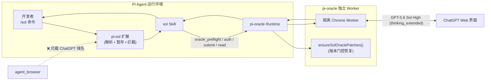
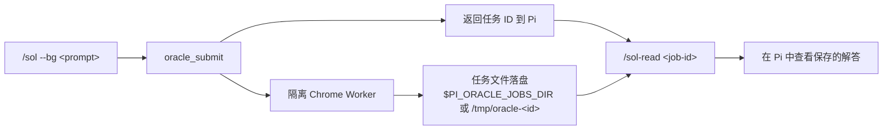

<div align="center">

# `pi-sol`

**无需离开 Pi coding-agent 会话，直接调用网页版 ChatGPT GPT-5.6 Sol High。**

[](./LICENSE)
[](https://nodejs.org)
[-10a37f.svg?style=flat-square)](https://chatgpt.com)
[](https://github.com/badlogic/pi-mono)
[](./CONTRIBUTING.md)

[English](./README.md) | **简体中文**

</div>

---

<!-- ==================== 演示视频/动图展示区 ==================== -->
<!-- 录制完成后，替换此区域为 GitHub 附件直链或本地文件路径 -->
<!--
<p align="center">
  <video src="https://github.com/user-attachments/assets/YOUR_VIDEO_ID.mp4" width="100%" autoplay loop muted playsinline poster="./docs/images/demo-poster.png"></video>
</p>
-->
<p align="center">
  
</p>
<!-- 终端演示录制方法：运行 `vhs scripts/record-demo.tape` 或使用 `./scripts/convert-demo.sh <input.mov>` 转换屏幕录屏 -->
<!-- ======================================================== -->

## 核心亮点

- ⚡ **会话零切换**：在 Pi 终端编程会话内直接调用 ChatGPT GPT-5.6 Sol High 深度思考。
- 🎯 **锁定 High 推理档位**：固定使用 `thinking_extended`（Plus High）预设，**绝不静默降级**至 Instant 或 Standard。
- 📁 **严格文件显式暂存**：仅发送通过 `--files a,b` 明确指定的文件，绝不自动打包或上传全项目代码。
- 🛡️ **浏览器会话防冲突**：自动拦截 `agent_browser` 访问 ChatGPT 域名，防止双重自动化抢占登录态。
- 🔒 **跨 Pi 提交仲裁**：跨本机多个 Pi 会话以 kernel-flock 协调 ChatGPT 提交（默认并发上限 2），达到上限时明确报告任务，不再静默冲突退出。
- 🔄 **自动补丁维护**：内置适配 2026-08 ChatGPT Plus 紧凑型 UI 与 Power-slider 滑块的 worker 补丁与自动恢复机制。
- ⏳ **同步与后台双模式**：支持阻塞等待实时解答，也支持 `--bg` 后台提交并在稍后通过 `/sol-read` 查阅。

---

## 目录

- [环境要求](#环境要求)
- [快速开始](#快速开始)
- [命令详解](#命令详解)
- [为什么使用 pi-sol](#为什么使用-pi-sol)
- [工作原理](#工作原理)
- [pi-oracle 0.7.20 兼容性边界](#pi-oracle-0720-兼容性边界)
- [行为保证](#行为保证)
- [故障排查](#故障排查)
- [常见问题](#常见问题)
- [开发与演示录制](#开发与演示录制)
- [贡献指南](#贡献指南)
- [许可证](#许可证)

---

## 环境要求

在安装前，请确认：

- 已安装并可正常运行的 [Pi](https://github.com/badlogic/pi-mono) coding agent
- 已安装 `npm:pi-oracle`
- 本地 Chrome 已登录 ChatGPT **Plus** 账号
- Node.js **22 或更高版本**
- 运行 `/sol-auth` 之前，请将 Chrome 界面语言调整为 **English**
- C/C++ 编译工具链（macOS 上为 Xcode Command Line Tools）——`/sol` 提交仲裁使用原生 `fs-ext` 扩展提供内核级 `flock`，安装时会编译

> [!IMPORTANT]
> **`PI_SOL_STATE_DIR` 必须位于支持可靠 OS 咨询锁（advisory locking）语义的本地文件系统上。**
>
> `/sol` 提交仲裁会在该目录下的锁文件上获取排他 `flock(2)`。网络/分布式/FUSE 类文件系统（NFS/SMB 等）不受支持，除非其锁语义已被明确验证——此类挂载点上的 flock 可能静默降级或失败，从而破坏跨 Pi 提交仲裁保证。

> [!IMPORTANT]
> **Chrome 必须使用英文界面才能完成 ChatGPT 认证。**
>
> 中文 Chrome 界面会让隔离浏览器卡在 Cloudflare「请稍候…」或 `about:blank`，导致 `/sol-auth` 拿不到可用的 ChatGPT 登录态。
>
> 打开 `chrome://settings/languages`，把 **English** 移到最上方，完全退出并重启 Chrome，然后再次运行 `/sol-auth`。

> [!IMPORTANT]
> Vendor worker 恢复逻辑带有版本门控；具体的标记检查、恢复规则和版本不匹配行为见 [pi-oracle 0.7.20 兼容性边界](#pi-oracle-0720-兼容性边界)。

---

## 快速开始

### 1. 安装

```bash
git clone https://github.com/xiangbianpangde/pi-sol.git
cd pi-sol
./scripts/install.sh
```

安装脚本会把扩展、skill 和补丁文件复制到 Pi 配置目录（`~/.pi/agent/`），并在该目录安装原生 `fs-ext` 扩展。如果检测到正在运行的 Pi 进程（进程名为 `pi` 或 argv 含 `pi-coding-agent`），安装脚本会拒绝继续——从 `ac52249` 之前的 pathname 协议升级到 kernel-flock 协议是 **stop-the-world** 操作，因为两代协调协议之间没有共同的互斥锁，若同时运行可能导致重复提交。请先关闭所有 Pi 会话；如需强制覆盖（不推荐），设置 `PI_SOL_FORCE_UPGRADE=1`。

### 2. 重新加载 Pi

在 Pi 会话中运行：

```text
/reload
```

或者直接新开一个 Pi 会话。

### 3. 认证 ChatGPT

```text
/sol-auth
```

该命令会把本地 Chrome 中的 ChatGPT 登录 Cookie 同步到 pi-oracle 的隔离浏览器 seed 中。

> [!WARNING]
> `/sol-auth` 会接触你的 ChatGPT 会话 Cookie。**绝对不要**把 ChatGPT Cookie、Chrome profile 数据或 `oracle-auth-seed-profile` 文件提交到仓库、贴到 issue / 聊天中，或以任何其他方式分享。

### 4. 运行 smoke test

验证同步请求：

```text
/sol ping
```

验证后台任务流程：

```text
/sol --bg ping
```

读取后台任务结果：

```text
/sol-read <job-id>
```

完成验证后，即可正式提问：

```text
/sol 审查此架构设计并指出其中风险最高的三个假设。
```

---

## 命令详解

| 命令 | 说明 |
|---|---|
| `/sol [--bg] [--follow <job-id>] [--files a,b] <prompt>` | 向 ChatGPT GPT-5.6 Sol High 提问。默认同步等待解答返回。 |
| `/sol-followup <job-id> [--bg] [--files a,b] <prompt>` | 继续之前的 `/sol` ChatGPT 对话上下文。 |
| `/sol-read [job-id]` | 读取已保存的任务结果。ID 必须是规范 UUIDv4，响应只从经过校验的任务目录读取。 |
| `/sol-auth` | 将本地 Chrome 的 ChatGPT 登录 Cookie 同步到 pi-oracle 隔离环境。 |
| `/sol-diag [--last N] [--candidates]` | 查看只记录、不改变行为的触发诊断日志。 |
| `/sol-open [--grok|--chatgpt] [--url <https-url>]` | 打开 pi-oracle 的隔离 auth-seed Chrome（**有头、且不开放远程调试端口**），用于手工修复登录态失效或模型档位不对。 |

> `/sol --follow <job-id> <prompt>` 和 `/sol-followup <job-id> <prompt>` **均可用于继续已有会话**，按个人习惯选用即可。

### 常用参数

- **默认模式（同步）**：阻塞等待 Sol High 完成深度思考并将答案输出在 Pi 中。
- **`--bg`**：后台提交任务并立即返回任务 ID，稍后使用 `/sol-read <job-id>` 查看。
- **`--files a,b`**：仅附加明确列出的文件。绝不自动全量扫描或打包仓库。
- **`--follow <job-id>`**：跟随上一次 `/sol` 调用的对话线索。

`/sol-open` 打开的正是每个任务克隆所用的那个 profile。若该 provider 有活跃任务，命令会拒绝打开；反过来，`oracle_submit`/`oracle_recover` 的工具门也会在手工 Chrome 占用 seed 时拒绝克隆。若该 profile 已被打开，`/sol-open` 只报告存活 PID，不会再起一个 Chrome（那会撞上 Chromium 单例锁）。启动 URL 仅允许 HTTPS，且始终不开放 DevTools 端口，因此任何 agent 都无法接入这个手工窗口。

ChatGPT 提交允许本机多个 Pi 会话并发运行最多 `maxConcurrentJobs`（默认 2）个 `/sol` 任务；每个任务运行在各自隔离的浏览器 runtime profile 中。当达到并发上限时，新提交会被阻止并显示活跃任务 ID；等待其中一个完成后使用 `/sol-read <job-id>`。这是针对账号级限流的保护，不是 pi-oracle 隔离浏览器 profile 的并发限制。

---

## 为什么使用 pi-sol

### pi-sol 与其他方案对比

| 功能特性 | `pi-sol` | 原生 `pi-oracle` | 手动在浏览器提问 |
|---|:---:|:---:|:---:|
| 深度集成进 Pi 终端工作流 | ✅ **是** | ⚠️ 部分支持 | ❌ 否 |
| 强制锁定 Plus High (`thinking_extended`) | ✅ **保证不降级** | ⚠️ 需手动指定 | ⚠️ 需手动点选 |
| 自动修补 2026-08 Plus High 界面 | ✅ **全自动** | ❌ 需手动处理 | ➖ 不适用 |
| 显式精细文件暂存 (`--files`) | ✅ **内置安全检查** | ⚠️ 需原生命令 | ⚠️ 手动拖拽上传 |
| 防 `agent_browser` 浏览器冲突 | ✅ **强制拦截** | ❌ 无拦截 | ➖ 不适用 |
| 后台任务 (`--bg` + `/sol-read`) | ✅ **支持** | ✅ 支持 | ❌ 否 |

---

## 工作原理



`pi-sol` 自身不会启动第二个浏览器。扩展层负责命令解析、选定文件暂存与注入提示词，并阻止 `agent_browser` 触碰 ChatGPT 域名；Pi 内的 `sol` skill 负责驱动 `oracle_*` 流程，由 `pi-oracle` 独占控制 Chrome 隔离实例。

### 后台任务生命周期



---

## pi-oracle 0.7.20 兼容性边界

`pi-sol` 内置了基于 **pi-oracle 0.7.20** 适配的 High / Power-slider 补丁。未打补丁的 0.7.20 worker 在面对紧凑型模型选择器时容易报错：

```text
Could not open effort dropdown for requested effort: Extended
Could not find model family control for instant
```

**补丁自动恢复遵循严格准则：**

1. 在 `session_start` 与每次 `before_agent_start` 时，检查已安装 worker 是否包含 High / Power-slider 特征标记。
2. Vendor digest 必须存在、可解析，并绑定 `ORACLE_VERSION`、所有部署的 worker/library 副本及补丁文件；缺失、损坏或不匹配都会 fail-closed，标记存在本身不是完整性证明。
3. 若标记已齐全，已安装副本必须匹配已审核的 pristine hash 或可信 patched hash；第三种 hash 会 fail-closed。
4. 若 vendored 版本缺少标记，会在 authority 校验后恢复可信 worker 副本。
5. 若版本不同，`pi-sol` 仅在补丁可应用、authority/标记/语法检查全部通过时对新 pristine worker 自动 re-vendor；任何失败都会拒绝覆盖。
6. 补丁检查失败会在工具层硬阻断 `oracle_submit` 与 `oracle_recover`，不存在只提示模型的绕过路径。
7. 如果 ChatGPT 模型选择界面未知或无法正向证明 High，worker 会在上传/发送前 fail-closed；不会把缺失控件当作默认 High，也不会静默降级。若支持的运行遇到 effort 下拉菜单错误，Agent 可自行恢复补丁后以原档位重试。升级 `pi update npm:pi-oracle` 后若覆盖了文件，下次自动检查会按上述规则处理。

---

## 行为保证

### 模型选择
- `/sol` 严格针对 ChatGPT Plus 上的 GPT-5.6 Sol **High**。
- 内部预设名称为 `thinking_extended`。
- **绝不静默降级**到 Instant 或 Standard；如果界面无法正向证明 High，worker 会在上传/发送前 fail-closed。

### 浏览器权限独占
ChatGPT 网页自动化完全归属于 pi-oracle 隔离 worker。`pi-sol` 会阻止 `agent_browser` 打开以下域名：
- `chatgpt.com`, `www.chatgpt.com`
- `chat.openai.com`, `chatgpt.openai.com`
- `auth.openai.com`

项目外文件若 basename 重复，会被改用无冲突的暂存名；不会有选中的文件静默覆盖另一个文件。`/sol-read` 会拒绝路径穿越 ID，并限制响应读取在已验证的任务目录内。

### 文件暂存与安全边界
- 本地文件上传完全遵循显式选择原则（`--files`）。
- 单次最多上传 **10 个文件**。
- 图片上限 **20 MiB** | 表格上限 **50 MiB** | 文本上限 **20 MiB**。
- **本地拦截**：常见可执行程序与安装包（`.exe`, `.dmg`, `.apk` 等）。

### 跨会话提交仲裁
- 使用一个 per-user kernel-flock 短时租约协调 `/sol-open`、`oracle_submit` 与 `oracle_recover` 的跨 Pi 进程交接；`/sol-open` 会持锁覆盖 Chrome 启动。
- `queued`、`preparing`、`submitted`、`waiting` 状态的 `job.json` 会被视为正在占用。
- 终态任务不阻塞新任务。提交仲裁锁是内核级 flock：持有进程退出或崩溃时由内核自动释放（无 TTL、无 stale 锁回收）。
- 如果最终错误是 `rate limit`，仍表示账号配额窗口耗尽，不能通过切换模型档位绕过。

---

## 故障排查

<details>
<summary><b>1. <code>/sol-auth</code> 卡在「请稍候…」或 <code>about:blank</code></b></summary>

<br/>

优先检查 Chrome 的界面语言设置：
1. 打开 `chrome://settings/languages`。
2. 将 **English** 拖动置顶。
3. 完全退出 Chrome（macOS 上按 `Cmd + Q`）。
4. 重新启动 Chrome。
5. 重新执行 `/sol-auth`。

非英文界面会导致隔离浏览器无法正确完成 ChatGPT 交互识别。
</details>

<details>
<summary><b>2. <code>/sol-auth</code> 提示 Chrome Cookie 数据库被锁定</b></summary>

<br/>

完全退出 Chrome 一次（`Cmd + Q`），然后重新运行：
```text
/sol-auth
```
这是由于浏览器后台进程独占占用 Cookie 数据库锁导致的。
</details>

<details>
<summary><b>3. 出现 <code>Could not open effort dropdown for requested effort: Extended</code></b></summary>

<br/>

同时可能伴随 `Could not find model family control for instant`。

重新加载 Pi（`/reload`）或新建会话重试。若问题依旧，请确认 `pi-oracle` 版本是否为 `0.7.20`（`pi-sol` 会自动维护该版本的补丁）。
</details>

<details>
<summary><b>4. 提示 pi-oracle 版本不匹配</b></summary>

<br/>

如果安装了其他版本的 `pi-oracle` 且缺少必要特征码，`pi-sol` 为安全起见会拒绝强行覆盖。请通过 `npm list -g pi-oracle` 查看当前版本。
</details>

<details>
<summary><b>5. <code>/sol</code> 提示 High 档位不可用</b></summary>

<br/>

请确认：
- 当前认证的账号拥有有效的 ChatGPT **Plus** 订阅。
- 该账号在 ChatGPT Web 端能够正常使用 High 思考档位。
</details>

<details>
<summary><b>6. 提示另一个 <code>/sol</code> 任务正在运行</b></summary>

<br/>

这是有意的跨 Pi 提交仲裁。等待提示中的任务完成，然后查看：
```text
/sol-read <job-id>
```
不要反复重试，也不要用 `agent_browser` 直接打开 ChatGPT。如果最终提示 `rate limit`，应等待 ChatGPT 账号配额窗口恢复。
</details>

<details>
<summary><b>7. <code>agent_browser</code> 拒绝打开 chatgpt.com</b></summary>

<br/>

这是预期内的安全保护机制，用于避免多浏览器会话冲突。请直接在终端使用 `/sol <问题>`。
</details>

---

## 常见问题

<details>
<summary><b>什么是 "Sol High"？</b></summary>
在本扩展中，Sol High 指代 ChatGPT 网页端 GPT-5.6 的 ChatGPT Plus High 深度思考模式（内部命名为 <code>thinking_extended</code>）。
</details>

<details>
<summary><b>/sol 会降级到 Instant 或 Standard 吗？</b></summary>
不会。若无法激活指定的 High 思考配置，<code>pi-sol</code> 将直接报错返回，绝不静默降低推理质量。
</details>

<details>
<summary><b>我的提问和代码会被发送到 OpenAI 吗？</b></summary>
会。问题内容以及通过 <code>--files</code> 显式指定的文件会被提交至 ChatGPT Web 端。全项目代码不会被自动上传。
</details>

---

## 开发与演示录制

### 运行自动化测试

```bash
npm ci
npm test
```

测试命令使用 Node 22 内置的 TypeScript stripping，不会从网络解析未锁定的测试运行器。安装脚本只安装运行时文件；完整测试请在本仓库 checkout 中执行。

### 录制与生成演示动图/视频

- **使用 VHS 自动录制（推荐）**：
  ```bash
  brew install charmbracelet/vhs/vhs
  vhs scripts/record-demo.tape
  ```
- **使用 FFmpeg 转换屏幕录屏（MOV/MP4 转高质量 GIF/WebP）**：
  ```bash
  ./scripts/convert-demo.sh ~/Desktop/recording.mov demo
  ```

### 项目结构

```text
pi-sol/
├── README.md                    # 英文说明文档
├── README.zh-CN.md              # 简体中文说明文档
├── docs/
│   ├── design.md                # 架构设计与 UI 补丁说明
│   └── images/                  # 截图、Banner、演示动图与视频
├── extensions/
│   ├── sol.ts                   # Pi 斜杠命令与 Hook
│   ├── lib/sol/                 # 解析器、防冲突 Guard、文件暂存与补丁
│   └── __tests__/               # Node 测试套件
├── skills/
│   └── sol/SKILL.md             # Pi 内置 agent 执行规范
└── scripts/
    ├── install.sh               # 安装到 ~/.pi/agent
    ├── record-demo.tape         # VHS 自动录屏脚本
    └── convert-demo.sh          # 录屏转换调色脚本
```

---

## 贡献指南

欢迎提交 Issue 和 Pull Request。在进行任何代码或补丁改动前，请参阅：
- [`CONTRIBUTING.md`](./CONTRIBUTING.md) — 补丁与测试规范
- [`AGENTS.md`](./AGENTS.md) — Coding-agent 约束原则
- [`skills/sol/SKILL.md`](./skills/sol/SKILL.md) — Pi 运行规约

**请勿在 Issue 或 PR 中附带任何 ChatGPT Cookie 或 Chrome Profile 敏感数据。**

---

## 许可证

[MIT](./LICENSE) © [xiangbianpangde](https://github.com/xiangbianpangde)。
Vendor worker 代码基于 [pi-oracle](https://github.com/fitchmultz/pi-oracle) 打补丁构建（MIT，© Mitch Fultz）。详见 [NOTICE](./NOTICE)。