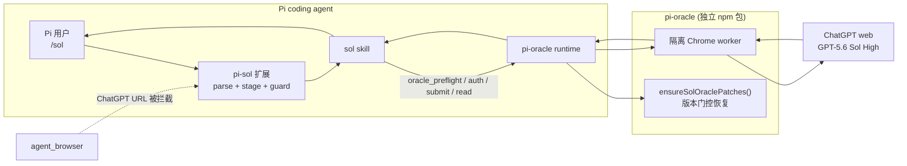
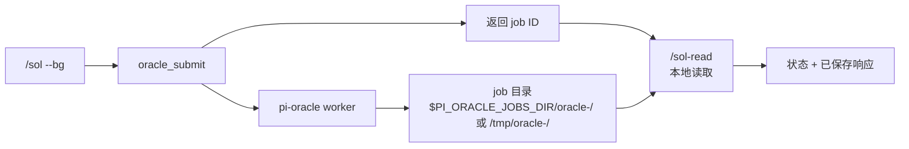

# pi-sol — 在 Pi 中用 `/sol` 调用 ChatGPT GPT-5.6 Sol High

**无需离开 Pi coding-agent 会话，直接调用网页版 ChatGPT GPT-5.6 Sol High。**

`pi-sol` 是构建在 [pi-oracle](https://github.com/fitchmultz/pi-oracle) 之上的轻量 Pi 扩展。Pi 负责整理问题和你明确选择的本地文件；隔离的 pi-oracle 浏览器 worker 独占 ChatGPT 会话，并把答案返回给 Pi。

模型预设固定为 ChatGPT Plus **High**（`thinking_extended`）。`/sol` 不会静默降级到 Instant 或 Standard。


[English](./README.md) | **简体中文**

---

## 目录

- [环境要求](#环境要求)
- [快速开始](#快速开始)
- [命令](#命令)
- [为什么使用 pi-sol](#为什么使用-pi-sol)
- [pi-oracle 0.7.20 兼容性边界](#pi-oracle-0720-兼容性边界)
- [工作原理](#工作原理)
- [行为保证](#行为保证)
- [故障排查](#故障排查)
- [常见问题](#常见问题)
- [开发](#开发)
- [贡献](#贡献)
- [许可证](#许可证)

---

## 环境要求

安装前请确认：

- 已正常工作的 [Pi](https://github.com/badlogic/pi-mono)
- 已安装 `npm:pi-oracle`
- 本机 Chrome 中已登录 ChatGPT **Plus** 账号
- Node.js **22 或更新版本**
- 运行 `/sol-auth` 前，请将 Chrome 界面语言设为 **English**

> [!IMPORTANT]
> **Chrome 必须使用英文界面才能完成 ChatGPT 认证。**
>
> 中文 Chrome 界面会让隔离浏览器卡在 Cloudflare「请稍候…」或 `about:blank`，导致 `/sol-auth` 拿不到可用的 ChatGPT 登录态。
>
> 打开 `chrome://settings/languages`，把 **English** 移到最上方，完全退出并重启 Chrome，然后再次运行 `/sol-auth`。

> [!IMPORTANT]
> Vendor worker 恢复逻辑带有版本门控；具体的标记检查、恢复规则和版本不匹配行为见 [pi-oracle 0.7.20 兼容性边界](#pi-oracle-0720-兼容性边界)。

---

## 快速开始

### 1. 安装

```bash
git clone https://github.com/xiangbianpangde/pi-sol.git
cd pi-sol
./scripts/install.sh
```

安装脚本会把扩展、skill 和随仓库提供的补丁文件复制到 Pi 配置目录（`~/.pi/agent/`）；是否把补丁恢复到已安装的 pi-oracle worker，会在运行时按照下方 [兼容性规则](#pi-oracle-0720-兼容性边界)决定。

### 2. 重新加载 Pi

在 Pi 中运行：

```text
/reload
```

或者直接新建一个 Pi 会话。

### 3. 认证 ChatGPT

```text
/sol-auth
```

该命令会把本地 Chrome 中的 ChatGPT 登录 Cookie 同步到 pi-oracle 的隔离浏览器 seed 中。

> [!WARNING]
> `/sol-auth` 会接触你的 ChatGPT 会话 Cookie。**绝对不要**把 ChatGPT Cookie、Chrome profile 数据或 `oracle-auth-seed-profile` 文件提交到仓库、贴到 issue / 聊天中，或以任何其他方式分享。

### 4. 运行 smoke test

先验证同步请求：

```text
/sol ping
```

再验证后台任务路径：

```text
/sol --bg ping
```

复制返回的 job ID，然后读取该任务：

```text
/sol-read <job-id>
```

正常情况下，同步请求应能完成，后台任务也应可被读取，并且不会静默降级到 Instant 或 Standard。

<!-- 截图占位 — 先添加该文件再取消图片行注释：

画面应包含 `/sol ping`、`/sol --bg ping`、返回的 job ID，以及 `/sol-read <job-id>`；请裁掉账号标识、ChatGPT conversation URL、Cookie、私有 prompt 和无关终端历史。
-->

完成 smoke test 后，可以试试真实问题：

```text
/sol Review this architecture decision and identify the three highest-risk assumptions.
```

---

## 命令

| 命令 | 作用 |
|---|---|
| `/sol [--bg] [--follow <job-id>] [--files a,b] <prompt>` | 调用 ChatGPT GPT-5.6 Sol High。默认等待并返回结果。 |
| `/sol-followup <job-id> [--bg] [--files a,b] <prompt>` | 继续之前的 `/sol` ChatGPT 会话。 |
| `/sol-read [job-id]` | 读取已保存任务。不传 ID 时，会回退到配置的 jobs 目录中发现的某个 `oracle-*` 任务；需要明确结果时，应传入 `/sol` 返回的 job ID。 |
| `/sol-auth` | 把本地 Chrome 的 ChatGPT Cookie 同步到 pi-oracle 的隔离浏览器 seed 中。 |

> `/sol --follow <job-id> <prompt>` 与 `/sol-followup <job-id> <prompt>` **都会继续已有的 `/sol` ChatGPT 会话**。两种写法任选其一；`/sol-followup` 是专用命令形式。

### 常用选项

- **默认模式：** 同步执行，等待 Sol 完成并把答案返回到 Pi。
- **`--bg`：** 后台提交并立即返回 job ID；之后通过 `/sol-read` 读取。后台结果属于 pi-oracle job；如果设置了 `$PI_ORACLE_JOBS_DIR`，任务位于该目录下，否则位于 `/tmp/oracle-<id>/`。在 Pi 中通常直接使用 `/sol-read` 读取即可。
- **`--files a,b`：** 只发送你明确列出的文件，不会自动打包整个仓库。位于当前项目之外的文件会被复制到 `.pi/sol-staging/<id>/`，以便 pi-oracle 使用项目相对路径接收。
- **`--follow <job-id>`：** 继续已有的 `/sol` ChatGPT 会话；与上面的 `/sol-followup` 等价。

模型预设始终是 `thinking_extended`，`pi-sol` 用它表示 ChatGPT Plus 上的 GPT-5.6 Sol **High**。它不会静默降级到 Instant 或 Standard。完整的 Pi 内部执行流程见 [SKILL.md](./skills/sol/SKILL.md)。

---

## 为什么使用 pi-sol

`pi-sol` 为 Pi 提供一条受控的 ChatGPT web 调用路径：

- 不必离开 Pi 工作流，手动切换到 ChatGPT。
- 由 Pi 整理问题，并只带上你明确选择的本地文件。
- 支持同步请求和后台 `/sol` job。
- 可用 `/sol-followup` 继续此前的 ChatGPT 会话。
- ChatGPT 浏览器自动化始终留在 pi-oracle 的隔离 worker 中。
- 在满足条件时自动恢复 High / Power-slider 兼容补丁。

### 为什么要在 pi-oracle 之上再加一层 pi-sol？

`pi-oracle` 提供底层 ChatGPT 浏览器 worker；`pi-sol` 则补上面向 Pi 的使用契约：`/sol`、`/sol-followup` 等 slash command，固定的 `thinking_extended` / Plus **High** 预设且禁止静默降级，显式本地文件 staging，ChatGPT `agent_browser` guard，以及带版本门控的 worker 恢复机制。恢复边界的精确定义见 [pi-oracle 0.7.20 兼容性边界](#pi-oracle-0720-兼容性边界)。如果你只需要原始 ChatGPT 自动化，可以直接使用 `pi-oracle`；如果你希望在 Pi 中通过一个 `/sol` 命令稳定请求 Plus High，则安装 `pi-sol`。

### pi-sol vs 手动打开 chatgpt.com

| | `pi-sol` | 手动打开 ChatGPT |
|---|---|---|
| 留在 Pi 内完成 | 是 | 否 |
| 由 Pi 整理请求 | 是 | 手动 |
| 显式本地文件 staging | `--files` | 手动上传 |
| Pi 后台任务 | `--bg` + `/sol-read` | 没有 Pi 管理的 job |
| 继续之前的 `/sol` 会话 | `/sol-followup` | 单独的浏览器流程 |
| ChatGPT 浏览器归属 | 隔离的 pi-oracle worker | 你的普通浏览器 |
| pi-oracle High 兼容处理 | 在支持的条件下自动处理 | 不适用 |

---

## pi-oracle 0.7.20 兼容性边界

`pi-sol` 随仓库携带一组基于 **pi-oracle 0.7.20** 的 High / Power-slider 兼容补丁。未打补丁的 0.7.20 worker 在面对 compact / Power 模型选择界面时，可能出现类似下面的错误：

```text
Could not open effort dropdown for requested effort: Extended
Could not find model family control for instant
```

恢复规则刻意设计得很窄：

1. 在 `session_start` 和每次 `before_agent_start` 时，`pi-sol` 都会检查已安装 worker 是否包含所需的 High / Power-slider 补丁标记。
2. 如果所有必需标记都已经存在，就不需要复制 vendor 文件。
3. 如果缺少标记，只有当已安装的 `pi-oracle` 版本与 vendor 版本**完全一致（0.7.20）**时，`pi-sol` 才会恢复随仓库提供的 worker 文件。
4. 如果已安装版本不同或无法读取，`pi-sol` 会拒绝覆盖 worker；不要把 0.7.20 vendor 文件强行复制到其他版本上。
5. `pi update npm:pi-oracle` 可能替换已经打过补丁的 worker 文件；只要满足恢复条件，下一次自动检查会重新恢复补丁。
6. 如果受支持的 High 请求仍然出现旧的 effort-dropdown 或 model-family-control 错误，Pi 内部 agent 可以自行执行一次恢复并用相同的 `thinking_extended` 再重试一次；**不应**要求用户手动运行补丁脚本，也**不能**把 `/sol` 降级到 Instant 或 Standard。

这里定义的是 vendor 恢复机制的兼容性边界；它**并不**等价于宣称其他所有 `pi-oracle` 版本一定支持或一定不支持 `pi-sol`。

---

## 工作原理



`pi-sol` 不会再创建第二条 ChatGPT 浏览器会话。扩展负责解析命令、staging 你明确选择的文件、注入 relay 指令，并在 `agent_browser` 中拦截 ChatGPT URL；Pi 内部的 `sol` skill 负责调用 `oracle_preflight`、`oracle_auth`、`oracle_submit` 和 `oracle_read`，而隔离 Chrome 会话始终由 pi-oracle 持有。

worker 补丁的具体判断规则统一见 [pi-oracle 0.7.20 兼容性边界](#pi-oracle-0720-兼容性边界)。

### 后台任务生命周期



同步的 `/sol` 复用同一条 `oracle_submit` + `oracle_read` 流程，只是在 Pi 中阻塞直到响应就绪。

更细的 hydration 规则和决策逻辑见 [SKILL.md](./skills/sol/SKILL.md) 和测试套件。

---

## 行为保证

### 模型选择

- `/sol` 目标固定为 ChatGPT Plus 上的 GPT-5.6 Sol **High**。
- 内部预设名为 `thinking_extended`。
- `pi-sol` 不会静默回退到 Instant 或 Standard。
- Extra High / Pro 不会被当成 Plus High 预设。

### 浏览器归属

ChatGPT 浏览器自动化只属于 pi-oracle 的隔离 worker。因此，`pi-sol` 会阻止 `agent_browser` 打开：

- `chatgpt.com`
- `www.chatgpt.com`
- `chat.openai.com`
- `chatgpt.openai.com`
- `auth.openai.com`

这样可以避免两条浏览器自动化路径争用同一个 ChatGPT 会话。需要访问 ChatGPT 时，请使用 `/sol`。

### 文件与本地 staging

用户选择的本地文件是**严格 opt-in**的：只有显式传入 `--files` 时才会加入请求。`pi-sol` 不会自动打包或上传整个仓库。

```text
/sol --files paper.pdf,src/example.ts <prompt>
```

内部可能会 staging 一个包含请求内容的 `request.md`。如果你明确选择的文件**位于当前项目之外**，它会被复制到 `.pi/sol-staging/<id>/`，以便 pi-oracle 使用项目相对路径接收；项目内文件则直接引用，不会复制。

**本地提交前检查：**

- 每次最多 **10 个文件**
- 图片：**20 MiB**
- 表格：**50 MiB**
- 已知文本 / 文档扩展名以及无扩展名文件：**20 MiB** 本地字节上限，作为 ChatGPT 约 **2M token** 文档限制的粗略代理
- 其他未被阻止的扩展名：**512 MiB** 硬上限
- **本地直接拒绝：** 已知可执行文件和安装包（`.exe`、`.dmg`、`.apk` 等）

这些检查可以拦住已知无效 payload，但并不完整复刻 ChatGPT web 的所有验证规则；ChatGPT 仍可能因为不支持的文件类型，或额外的 token、频率、存储、登录、challenge、policy 限制而拒绝请求。

### 认证与策略失败

登录失败、challenge 以及 content-policy 失败都被视为**终止条件**。`pi-sol` 不会绕过这些限制，也不会静默切换到其他模型。

### pi-oracle 更新

关于更新后的恢复行为、版本门控，以及"补丁标记已存在时不需要恢复"的例外，请统一查看 [pi-oracle 0.7.20 兼容性边界](#pi-oracle-0720-兼容性边界)；用户不应手动运行 worker 恢复脚本。

coding-agent 侧的不变量见 [AGENTS.md](./AGENTS.md)。
补丁开发规则见 [CONTRIBUTING.md](./CONTRIBUTING.md)。

---

## 故障排查

### `/sol-auth` 卡在「请稍候…」或 `about:blank`

先检查 Chrome 的界面语言：

1. 打开 `chrome://settings/languages`。
2. 把 **English** 移到最上方。
3. 完全退出 Chrome。
4. 重新打开 Chrome。
5. 运行：

```text
/sol-auth
```

受影响的中文 Chrome UI 可能使隔离 oracle 浏览器无法获得可用的 ChatGPT 登录态。

### `/sol-auth` 提示 Chrome Cookie 数据库被锁定

彻底退出 Chrome 一次，然后重试：

```text
/sol-auth
```

Chrome 运行时可能暂时锁住 Cookie 数据库。

### 出现 `Could not open effort dropdown for requested effort: Extended`

也可能同时看到：

```text
Could not find model family control for instant
```

重新加载 Pi（或新建会话），用同一个 `/sol` 请求重试；如果仍然报错，请查看 [pi-oracle 0.7.20 兼容性边界](#pi-oracle-0720-兼容性边界) 中的精确恢复和版本不匹配规则，不要改用 Instant 或 Standard 规避问题。

### pi-sol 报告 pi-oracle 版本不匹配

只有当补丁标记缺失、确实需要恢复时，版本不匹配才会阻止 vendor 恢复；精确规则见 [pi-oracle 0.7.20 兼容性边界](#pi-oracle-0720-兼容性边界)，不要把 vendor worker 强行覆盖到不同的已安装版本上。

### `/sol` 提示 High 不可用

`/sol` 有意固定为 Plus High。请检查：

- 你认证的是目标 ChatGPT Plus 账号，且 `/sol-auth` 成功。
- 当前 ChatGPT 会话本身能够使用 High。

`pi-sol` 不会静默替换为 Instant 或 Standard。

### `agent_browser` 拒绝打开 chatgpt.com

这是预期行为。ChatGPT 浏览器自动化专门保留给 pi-oracle 的隔离 worker，避免两条浏览器路径竞争。请改用：

```text
/sol <question>
```

### 文件在 `/sol` 提交前被拒绝

`--files` 在提交前会执行本地文件数量、字节大小以及已知可执行文件 / 安装包检查；精确规则见 [文件与本地 staging](#文件与本地-staging)，请移除被拒文件或缩小上传集合后重试。

### `/sol-read` 提示找不到 job

先创建一个 `/sol` 后台任务：

```text
/sol --bg <question>
```

然后读取返回的 job：

```text
/sol-read <job-id>
```

如果不提供 job ID，`/sol-read` 会回退到配置的 jobs 目录中发现的某个 `oracle-*` 任务，而且并不只筛选 `/sol` 任务；如果你还单独使用过 pi-oracle，请优先传入 `/sol` 返回的准确 job ID。

---

## 常见问题

### "Sol High" 是什么？

在本项目中，**Sol High** 指网页版 ChatGPT GPT-5.6 使用 ChatGPT Plus 的 **High** 推理档位。`pi-sol` 在内部把这个预设称为 `thinking_extended`。它与 Extra High 或 Pro 不是同一个档位。

### `thinking_extended` 是什么？

`thinking_extended` 是 `/sol` 为 ChatGPT Plus High 使用的 pi-oracle preset 名称，属于实现层细节。一般使用时只需要：

```text
/sol <question>
```

### `/sol` 会回退到 Instant 或 Standard 吗？

不会。如果无法建立要求的 High 配置，`pi-sol` 会把它当作错误处理，而不是静默返回更低档位的结果。

### 为什么 Chrome 必须使用英文界面？

`/sol-auth` 会把你现有的 ChatGPT 登录态导入 pi-oracle 的隔离浏览器环境。受影响的中文 Chrome UI 可能让认证流程卡在 Cloudflare「请稍候…」或 `about:blank`。请把 `chrome://settings/languages` 中的 **English** 移到最上方，彻底重启 Chrome，再运行 `/sol-auth`。

### 为什么不直接用 `agent_browser` 打开 chatgpt.com？

pi-oracle 已经拥有一个专门用于 ChatGPT 的隔离浏览器会话。如果再通过 Pi 的通用 `agent_browser` 打开 ChatGPT，就会出现第二条自动化路径，可能与 oracle worker 会话发生冲突。因此 `pi-sol` 会主动阻止 `agent_browser` 访问 ChatGPT URL，并要求统一使用 `/sol`。

### 我的 prompt 或文件会发送给 OpenAI 吗？

会。`/sol` 会把你的问题提交给 ChatGPT web，因此 prompt 会作为请求的一部分发送到 ChatGPT / OpenAI。文件**只有**在你显式使用 `--files` 列出时才会发送；`pi-sol` 不会自动打包或上传整个仓库。`/sol-auth` 还会把本地 ChatGPT 会话 Cookie 复制到 pi-oracle 的隔离浏览器 seed，因此不要提交、公开或分享这些 Cookie 与浏览器 profile 数据。

### 执行 `pi update npm:pi-oracle` 后会发生什么？

更新可能替换 pi-oracle 已安装的 worker；关于补丁标记检查、恢复边界和版本不匹配行为，请统一查看 [pi-oracle 0.7.20 兼容性边界](#pi-oracle-0720-兼容性边界)。

---

## 开发

### 测试

```bash
npm test
```

测试套件覆盖：

- `/sol` 命令解析
- 显式文件 staging 与验证（`--files` 数量 / 大小限制、可执行文件拒绝）
- `agent_browser` 的 ChatGPT 域名 guard
- High / Power-slider UI 处理
- 防止把 Instant 或 Medium 误判为 High
- 模拟 `pi-oracle` 更新后的自动补丁恢复
- 拒绝用 vendor 文件覆盖不支持或更新版本的 `pi-oracle`

### 项目结构

```text
README.md                    英文 README（本仓库默认）
README.zh-CN.md              简体中文 README
extensions/sol.ts              Pi slash commands + hooks
extensions/lib/sol/            parse, files, guard, jobs, prompts, patches
extensions/lib/sol/vendor/     patched pi-oracle 0.7.20 worker (MIT)
extensions/__tests__/          node:test suite
skills/sol/SKILL.md            Pi 内部模型执行流程
scripts/install.sh             复制到 ~/.pi/agent
```

本 README 引用的截图统一放在 `docs/screenshots/` 下。

---

## 贡献

欢迎提交 bug report 和 pull request。

修改 `/sol` 行为或随仓库提供的 worker 补丁前，请先阅读：

- [`CONTRIBUTING.md`](./CONTRIBUTING.md) — 补丁与测试要求
- [`AGENTS.md`](./AGENTS.md) — coding-agent 不变量
- [`skills/sol/SKILL.md`](./skills/sol/SKILL.md) — Pi 内部 oracle 执行流程

报告问题时，请提供：

- Pi 版本
- `pi-oracle` 版本
- 操作系统
- 完整的 `/sol` 命令或错误信息
- `/sol-auth` 是否成功

**不要**在 issue 中附带 ChatGPT Cookie、Chrome profile 或 `oracle-auth-seed-profile` 数据。

项目地址：[github.com/xiangbianpangde/pi-sol](https://github.com/xiangbianpangde/pi-sol)

---

## 许可证

MIT。Vendor worker 文件基于 [pi-oracle](https://github.com/fitchmultz/pi-oracle)（MIT，© Mitch Fultz）进行补丁修改。详见 [NOTICE](./NOTICE)。